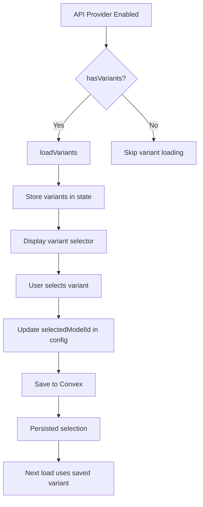
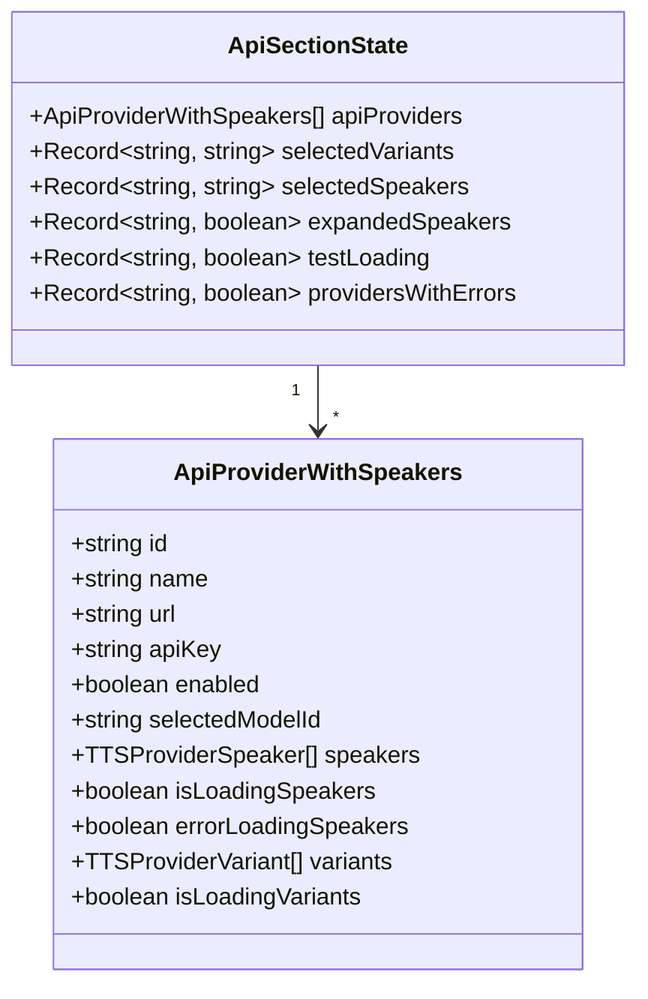

# TTS API Section Variants Feature Implementation Plan

## Overview
Add variants support to the API TTS section, similar to the local section. This includes:
- Loading and displaying available models/variants for API providers
- Selecting a default model (stored as `selectedModelId` in config)
- Persisting the selected model to the configuration

## Architecture

### Data Flow



### Component State Structure



## Implementation Steps

### 1. Update ApiProviderWithSpeakers Interface

**File:** `apps/web/src/shared/components/configuration/components/tts-tab/api-section.tsx`

Add variants-related fields to the interface:

```typescript
interface ApiProviderWithSpeakers extends ApiTTSProviderItem {
    speakers?: TTSProviderSpeaker[];
    isLoadingSpeakers?: boolean;
    errorLoadingSpeakers?: boolean;
    variants?: TTSProviderVariant[];  // NEW
    isLoadingVariants?: boolean;      // NEW
    errorLoadingVariants?: boolean;   // NEW
}
```

### 2. Add State Management for Variants

Add new state variables:

```typescript
const [selectedVariants, setSelectedVariants] = useState<Record<string, string>>({});
```

### 3. Implement Variant Loading Logic

Create a function to load variants for providers with `hasVariants`:

```typescript
const loadProviderVariants = async (providerId: string) => {
    const provider = apiProviders.find(p => p.id === providerId);
    if (!provider) return;

    // Check if plugin supports variants
    const plugin = plugins.find(p => p.info?.id === providerId);
    if (!plugin?.options?.hasVariants) return;

    setApiProviders(prev =>
        prev.map(p =>
            p.id === providerId ? { ...p, isLoadingVariants: true, errorLoadingVariants: false } : p
        )
    );

    try {
        const configuredPlugin = configureNonLocalProvider(providerId, {
            apiKey: provider.apiKey,
            url: provider.url,
        });

        if (!configuredPlugin?.loadVariants) {
            throw new Error(`Provider ${providerId} does not support loadVariants`);
        }

        const variants = await configuredPlugin.loadVariants();
        setApiProviders(prev =>
            prev.map(p =>
                p.id === providerId ? { ...p, variants, isLoadingVariants: false, errorLoadingVariants: false } : p
            )
        );
    } catch (error) {
        console.error(`Failed to load variants for provider ${providerId}:`, error);
        setApiProviders(prev =>
            prev.map(p =>
                p.id === providerId ? { ...p, isLoadingVariants: false, errorLoadingVariants: true } : p
            )
        );
    }
};
```

Add useEffect to load variants when provider is enabled:

```typescript
useEffect(() => {
    apiProviders.forEach(provider => {
        if (provider.enabled && !provider.variants && !provider.isLoadingVariants) {
            const plugin = plugins.find(p => p.info?.id === provider.id);
            if (plugin?.options?.hasVariants) {
                loadProviderVariants(provider.id);
            }
        }
    });
}, [apiProviders]);
```

### 4. Add Variant Selector UI

Add variant selector in the provider card (similar to local-section):

```tsx
{/* Variant selector - placed before the Load/Edit buttons */}
{plugin?.options?.hasVariants && provider.enabled && provider.variants && provider.variants.length > 0 && (
    <Select
        className="w-48"
        placeholder="Model"
        defaultSelectedKey={provider.selectedModelId || plugin.options.defaultVariant}
        onSelectionChange={(key) => handleVariantChange(provider.id, key)}
    >
        <Select.Trigger>
            <Select.Value />
            <Select.Indicator />
        </Select.Trigger>
        <Select.Popover>
            <ListBox>
                {provider.variants.map((variant: TTSProviderVariant) => (
                    <ListBox.Item
                        key={variant.id}
                        id={variant.id}
                        textValue={variant.name}
                    >
                        <div className="flex items-center justify-between gap-4">
                            <span>{variant.name}</span>
                        </div>
                        {provider.selectedModelId === variant.id && (
                            <ListBox.ItemIndicator />
                        )}
                    </ListBox.Item>
                ))}
            </ListBox>
        </Select.Popover>
    </Select>
)}
```

### 5. Implement Variant Selection Handler

```typescript
const handleVariantChange = async (providerId: string, key: React.Key | null) => {
    if (!key) return;
    const variantId = String(key);

    // Update local state for immediate UI feedback
    setSelectedVariants(prev => ({ ...prev, [providerId]: variantId }));

    // Update provider in state
    const updatedProviders = apiProviders.map(p =>
        p.id === providerId ? { ...p, selectedModelId: variantId } : p
    );
    setApiProviders(updatedProviders);

    // Persist to config
    await saveConfig(updatedProviders);
};
```

### 6. Set First Variant as Default When Adding Providers

Update `handleOpenAddModal` to set default variant:

```typescript
const handleOpenAddModal = async () => {
    const firstPlugin = apiPlugins[0] as OpenAITTSProvider;
    
    // Load variants to get the first one
    let defaultModelId = firstPlugin.options?.defaultVariant;
    
    if (firstPlugin?.options?.hasVariants && firstPlugin.loadVariants) {
        try {
            const variants = await firstPlugin.loadVariants();
            if (variants.length > 0) {
                defaultModelId = variants[0].id;
            }
        } catch (error) {
            console.error("Failed to load variants for default provider:", error);
        }
    }

    const defaultProvider = firstPlugin ? {
        id: firstPlugin.info?.id || "",
        name: firstPlugin.info?.name || "",
        url: firstPlugin.getApiUrl(),
        apiKey: "",
        enabled: false,
        selectedModelId: defaultModelId
    } : null;

    setEditModal({ isOpen: true, provider: defaultProvider, isEditing: false });
};
```

### 7. Update handleTestSpeaker to Use Selected Variant

```typescript
const handleTestSpeaker = async (providerId: string) => {
    const provider = apiProviders.find(p => p.id === providerId);
    const selectedSpeakerId = selectedSpeakers[providerId];
    const selectedVariantId = provider?.selectedModelId || selectedVariants[providerId];

    if (!provider || !selectedSpeakerId) return;

    const configuredPlugin = configureNonLocalProvider(providerId, {
        apiKey: provider.apiKey,
        url: provider.url,
    });

    if (!configuredPlugin) return;

    setTestLoading(prev => ({ ...prev, [providerId]: true }));

    try {
        const result = await configuredPlugin.speak({
            text: "Moonlight lingers softly on silent waters.",
            speakerId: selectedSpeakerId,
            variantId: selectedVariantId  // NEW: Pass variant
        });

        if (result.result?.audio) {
            const audio = new Audio(URL.createObjectURL(result.result.audio));
            audio.play();
        }
    } catch (error) {
        console.error(`Failed to test speaker for provider ${providerId}:`, error);
    } finally {
        setTestLoading(prev => ({ ...prev, [providerId]: false }));
    }
};
```

### 8. Update handleSaveProvider to Persist selectedModelId

The `handleSaveProvider` function already saves the entire provider object, which includes `selectedModelId`. No changes needed if the edit modal properly updates this field.

However, we need to ensure the edit modal can display and modify the selected variant. This may require adding a variant selector in the edit modal as well.

## File Changes Summary

| File | Changes |
|------|---------|
| `apps/web/src/shared/components/configuration/components/tts-tab/api-section.tsx` | Add variants support, state management, UI, and handlers |
| `apps/web/src/shared/types/config.ts` | Already has `selectedModelId` - no changes needed |

## Testing Checklist

- [ ] Variants load correctly for API providers with `hasVariants: true`
- [ ] Variant selector displays for enabled providers with variants
- [ ] Selecting a variant updates the config and persists
- [ ] First variant is set as default when adding a new provider
- [ ] Test speaker uses the selected variant
- [ ] Variants are re-loaded when provider is re-enabled
- [ ] Error handling for failed variant loads
